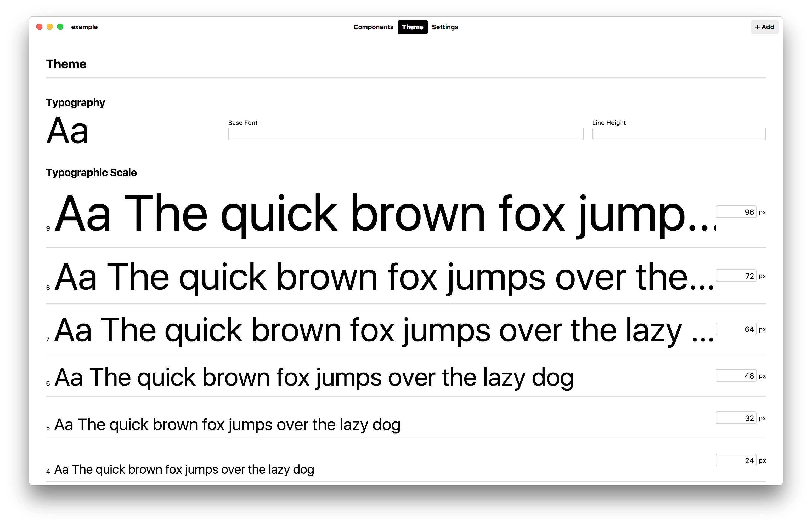
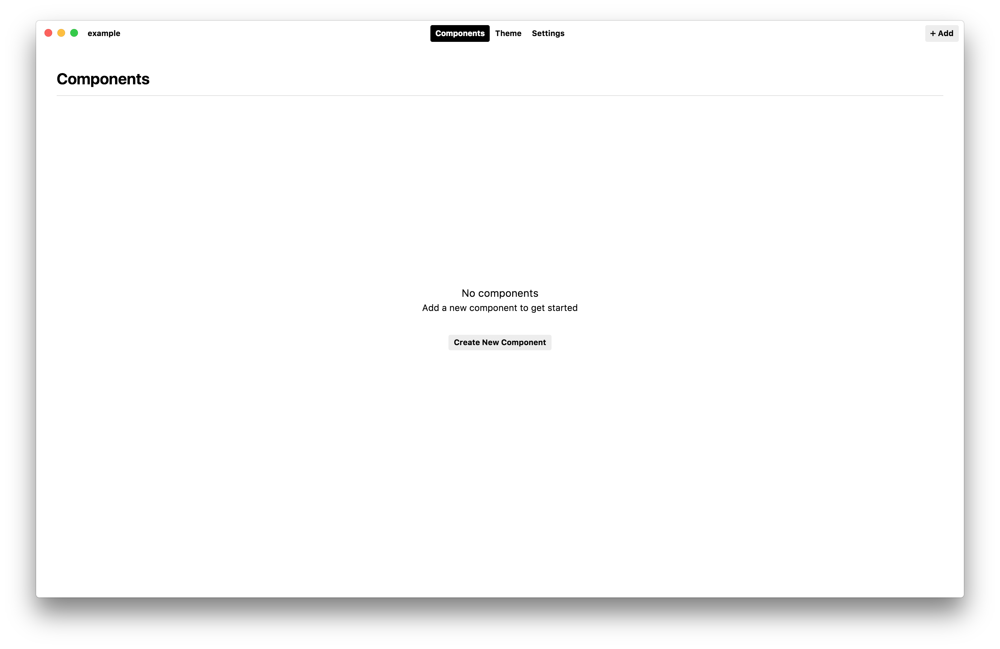
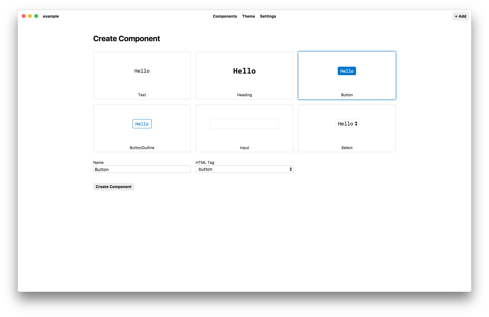

# Getting Started

First, choose a folder for a new project. This can be an existing react project that has a collection of components. Lab will save a `lab.json` and `theme.json` file.
We recommend you keep this folder under source control, using such as [git](https://git-scm.com).
Lab will automatically save changes made in the app, and by making use of source control, you‘ll keep a history of changes and make collaborating with others easier.

Once you‘ve got a new project open,
click the *Theme* (⌘2) tab at the top to set global styles for typography, color, and layout.



Lab helps create a visually consistent UI library by adhering to constraint-based scales.
This keeps elements properly aligned and adds a visual rhythm throughout your user interface.

## Components

Next, click on the *Components* (⌘1) tab to view the library of UI components.
You‘ll see an empty screen to start with, so you‘ll need to create or import some components.



Click the Add button in the upper right to create a new component.
Choose one of the built-in templates to start building and designing a component.
Each component needs a unique name. We recommend keeping it simple to start with, e.g. Button instead of PrimaryActionButton.



Once you‘ve created a component, you should see a minimally styled version, along with the style panel on the right.

Try adjusting the style controls on the right and creating a component that fits in with your visual style.


## Example Props

Once you‘ve got some basic styles set, you‘ll want to test the component out with different states to make sure it works.

React uses *props* to pass values into a component from the parent.
At the bottom of the right panel, you‘ll see a section called *Examples*.
Examples use JSX syntax so you can test how your component would work
in a real React application.

In the first code editor, try adding the following:

```js
<Button>
  Hello
</Button>
```

Next, below the code editor, click the *Add Example* button.
In the new editor box, add a longer string of text.

```js
<Button>
  Hello there, how are you?
</Button>
```

You can now switch between these two examples to see how your component responds in different situations.

Click the *Show all examples* radio to show all examples at once.


## Customizing Styles

To fine-tune the styles of your component, use the Styles editor.
Using a camelCased JavaScript object syntax, you can change things like
hover states, box shadows, transitions, or any other CSS property.

All CSS properties are camelCased, so instead of `box-shadow`, use `boxShadow` as the key.
All values need to be JavaScript strings, which means they should be enclosed in single quotes.

**More Documentation**

- [Extending Components](extending.md)
- [Composite Components](composite-components.md)
- [Importing Components](importing.md)
- [Exporting Components](exporting.md)
